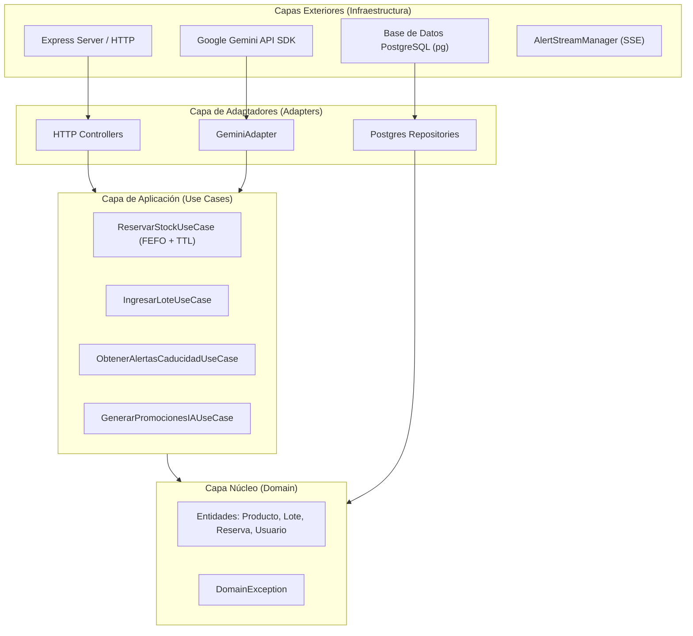

# Arquitectura de Software - Ecosistema Karen (Fase 1)

Este documento describe los principios de **Clean Architecture (Arquitectura Limpia)**, patrones de diseño y flujo de datos implementados en el servidor Backend del **Supermercado Karen**.

---

## 1. Principios y Filosofía de Diseño

El sistema está diseñado de afuera hacia adentro, garantizando la **Regla de Dependencia**: *Las capas internas nunca dependen de las capas externas*.

---

## 2. Descripción de Capas

### 2.1. Capa de Dominio (`/src/domain`)
* **Propósito**: Contiene el modelo mental y las reglas de negocio indispensables del Supermercado Karen.
* **Componentes**:
  * `Producto.js`: Entidad con reglas de validación de código de barras y precios.
  * `Lote.js`: Entidad núcleo que calcula días para caducar y aplica la política única: `VENCIDO` ≤ 0d, `ROJO` 1–6d, `AMARILLO` 7–14d y `NORMAL` ≥ 15d; además gestiona stock disponible, reservado y mermas.
  * `Reserva.js`: Entidad que administra el ciclo de vida de la reserva temporal, generación de PIN de cobro en caja SIACI y temporizador TTL (10 minutos).
  * `DomainException.js`: Excepción base de negocio.
* **Regla**: No importa ninguna librería externa ni cliente de base de datos.

### 2.2. Capa de Aplicación (`/src/use-cases`)
* **Propósito**: Orquesta el flujo de datos hacia y desde las entidades del dominio para cumplir los requerimientos del sistema.
* **Componentes**:
  * `ReservarStock.js`: Algoritmo Anti-Overbooking. Asigna stock ordenando lotes mediante **FEFO** (*First Expired, First Out*), reserva las unidades y genera la reserva con TTL.
  * `IngresarLote.js`: Registra nuevos lotes y emite notificaciones SSE inmediatas si el producto ingresado caduca pronto.
  * `ObtenerAlertasCaducidad.js`: Filtra lotes activos que caducan en menos de 15 días.
  * `GenerarPromocionesIA.js`: Analiza lotes de baja rotación invocando al adaptador de IA.

### 2.3. Capa de Adaptadores (`/src/adapters`)
* **Propósito**: Convierte los datos entre el formato conveniente para los casos de uso y el formato conveniente para agentes externos (HTTP, SQL, APIs de terceros).
* **Componentes**:
  * `controllers/`: Traduce peticiones HTTP Express a ejecuciones de Casos de Uso.
  * `db/`: Implementaciones concretas de repositorios mediante SQL nativo (`PostgresProductRepository`, `PostgresLotRepository`, `PostgresReservationRepository`).
  * `ai/GeminiAdapter.js`: Adaptador para la API de Gemini que genera copys y porcentajes de descuento con optimización de tokens y fallback determinístico.

### 2.4. Capa de Infraestructura (`/src/infrastructure`)
* **Propósito**: Aloja los frameworks, drivers, servidores y procesos de fondo.
* **Componentes**:
  * `http/`: Servidor Express, enrutador `/api/v1` y middleware centralizado de manejo de errores.
  * `sse/AlertStreamManager.js`: Canal de Server-Sent Events que empuja alertas en tiempo real hacia las aplicaciones frontend conectadas.
  * `workers/ReservationCleanerWorker.js`: Sweeper background que se ejecuta periódicamente liberando stock de reservas cuyos 10 minutos de TTL hayan expirado.

---

## 3. Patrones de Diseño Aplicados

1. **FEFO (First Expired, First Out)**: Las reservas asignan preferentemente el stock de lotes cuya fecha de caducidad sea más próxima, reduciendo el desperdicio por merma.
2. **Anti-Overbooking con TTL**: El inventario disponible se descuenta al instante en el carrito y se transfiere a stock reservado durante 10 minutos. Si la compra no se confirma en caja SIACI, un proceso background sweeper restaura automáticamente las unidades a stock libre.
3. **Event-Driven real-time (SSE)**: En lugar de polling pesado desde el frontend, el backend notifica al cliente movil de bodegueros al instante mediante conexiones `text/event-stream`.
