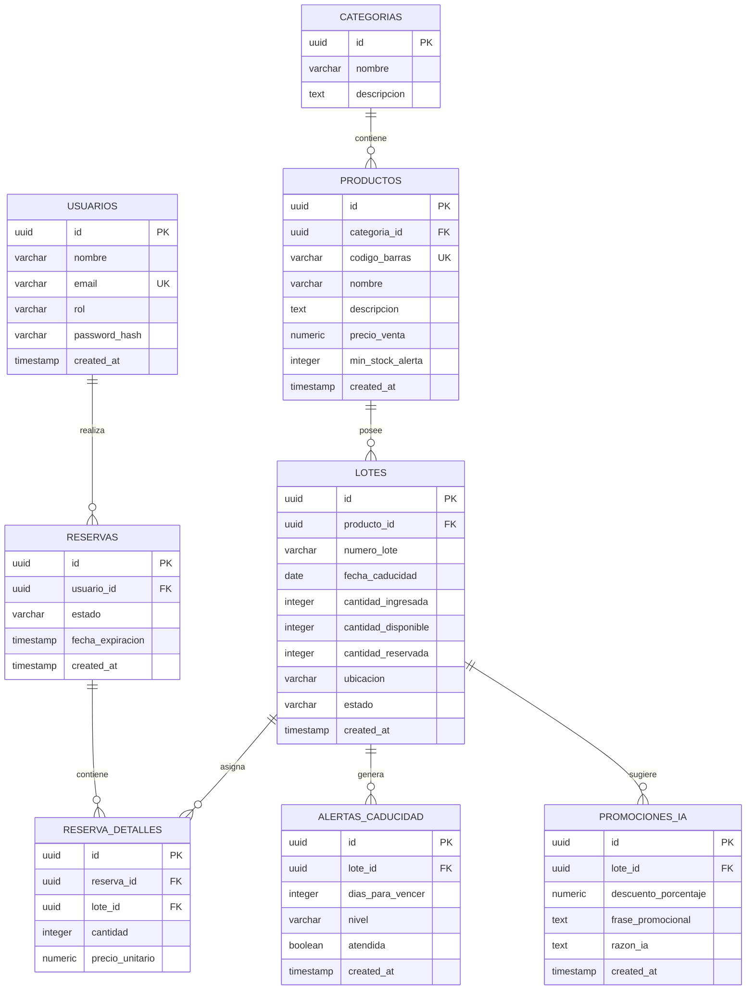

# Especificación de Base de Datos PostgreSQL - Ecosistema Karen (Fase 1)

> **Supermercado Karen** - Sistema de Inventario Maestro, Maduración de Lotes y Reservaciones de Stock.  
> **Motor de Base de Datos**: PostgreSQL 14+  
> **Nombre de la Base de Datos**: `ecosistema_karen`

---

## 1. Visión General de la Estructura de Datos

El diseño de la base de datos se fundamenta en la jerarquía: **`Producto -> Lote -> Fecha de Caducidad`**, permitiendo el control preciso del stock por lote de producción, la ubicación física (*Bodega* vs *Percha*) y las fechas de vencimiento para garantizar el principio **FEFO** (*First Expired, First Out*).



---

## 2. Tipos de Datos Personalizados (ENUMs)

Para asegurar la integridad de datos, se definen los siguientes tipos enumerados:

```sql
-- Rol de los usuarios dentro del sistema
CREATE TYPE rol_usuario AS ENUM ('CLIENTE', 'BODEGUERO', 'PERCHERO', 'ADMIN');

-- Ubicación física del lote dentro del supermercado
CREATE TYPE ubicacion_lote AS ENUM ('BODEGA', 'PERCHA');

-- Estado operativo del lote de inventario
CREATE TYPE estado_lote AS ENUM ('ACTIVO', 'VENCIDO', 'AGOTADO', 'MERMA');

-- Estado del ciclo de vida de una reserva de stock (Anti-Overbooking)
CREATE TYPE estado_reserva AS ENUM ('PENDIENTE', 'CONFIRMADA', 'EXPIRADA', 'CANCELADA');

-- Nivel de severidad de la alerta de caducidad
CREATE TYPE nivel_alerta AS ENUM ('AMARILLO', 'ROJO');
```

---

## 3. Diccionario de Datos Detallado

### 3.1. Tabla `categorias`
Almacena la clasificación general de los productos comercializados en Supermercado Karen.

| Columna | Tipo de Dato | Nulo | Descripción / Constraints |
| :--- | :--- | :---: | :--- |
| `id` | `UUID` | **NO** | Clave Primaria (`DEFAULT gen_random_uuid()`) |
| `nombre` | `VARCHAR(100)` | **NO** | Nombre único de la categoría (ej. Lácteos, Embutidos) |
| `descripcion` | `TEXT` | SÍ | Descripción breve de la categoría |
| `created_at` | `TIMESTAMPTZ` | **NO** | Fecha de creación (`DEFAULT CURRENT_TIMESTAMP`) |

### 3.2. Tabla `productos`
Contiene la información de catálogo de los artículos.

| Columna | Tipo de Dato | Nulo | Descripción / Constraints |
| :--- | :--- | :---: | :--- |
| `id` | `UUID` | **NO** | Clave Primaria (`DEFAULT gen_random_uuid()`) |
| `categoria_id` | `UUID` | **NO** | FK a `categorias(id)` ON DELETE RESTRICT |
| `codigo_barras` | `VARCHAR(50)` | **NO** | Código EAN/UPC único (`UNIQUE`) |
| `nombre` | `VARCHAR(150)` | **NO** | Nombre comercial del producto |
| `descripcion` | `TEXT` | SÍ | Detalle del producto, peso o volumen |
| `precio_venta` | `NUMERIC(10,2)` | **NO** | Precio unitario de venta (`CHECK > 0`) |
| `min_stock_alerta` | `INTEGER` | **NO** | Umbral mínimo de stock general (`DEFAULT 10`) |
| `created_at` | `TIMESTAMPTZ` | **NO** | Timestamp de creación |
| `updated_at` | `TIMESTAMPTZ` | **NO** | Timestamp de última actualización |

### 3.3. Tabla `lotes`
**Tabla Núcleo**: Almacena cada lote de producción recibido con su fecha de expiración y estado de inventario actual.

| Columna | Tipo de Dato | Nulo | Descripción / Constraints |
| :--- | :--- | :---: | :--- |
| `id` | `UUID` | **NO** | Clave Primaria (`DEFAULT gen_random_uuid()`) |
| `producto_id` | `UUID` | **NO** | FK a `productos(id)` ON DELETE CASCADE |
| `numero_lote` | `VARCHAR(50)` | **NO** | Código del lote asignado por proveedor o interno |
| `fecha_caducidad` | `DATE` | **NO** | Fecha límite de caducidad del lote |
| `cantidad_ingresada`| `INTEGER` | **NO** | Unidades recibidas inicialmente (`CHECK >= 0`) |
| `cantidad_disponible`| `INTEGER` | **NO** | Stock libre para reserva/venta (`CHECK >= 0`) |
| `cantidad_reservada`| `INTEGER` | **NO** | Stock bloqueado en carrito activo (`CHECK >= 0`) |
| `ubicacion` | `ubicacion_lote`| **NO** | `BODEGA` o `PERCHA` (`DEFAULT 'BODEGA'`) |
| `estado` | `estado_lote` | **NO** | `ACTIVO`, `VENCIDO`, `AGOTADO`, `MERMA` |
| `created_at` | `TIMESTAMPTZ` | **NO** | Timestamp de ingreso |
| `updated_at` | `TIMESTAMPTZ` | **NO** | Timestamp de actualización |

### 3.4. Tabla `usuarios`
Gestión de cuentas para clientes finales y personal operativo del supermercado.

| Columna | Tipo de Dato | Nulo | Descripción / Constraints |
| :--- | :--- | :---: | :--- |
| `id` | `UUID` | **NO** | Clave Primaria (`DEFAULT gen_random_uuid()`) |
| `nombre` | `VARCHAR(120)` | **NO** | Nombre y apellido del usuario |
| `email` | `VARCHAR(150)` | **NO** | Correo electrónico único (`UNIQUE`) |
| `rol` | `rol_usuario` | **NO** | Rol en el sistema (`CLIENTE`, `BODEGUERO`, etc.) |
| `password_hash` | `VARCHAR(255)` | **NO** | Hash de la contraseña de acceso |
| `created_at` | `TIMESTAMPTZ` | **NO** | Timestamp de registro |

### 3.5. Tabla `reservas`
Cabecera de reservas de stock para la App de Clientes con temporizador Anti-Overbooking (TTL de 10 minutos por defecto).

| Columna | Tipo de Dato | Nulo | Descripción / Constraints |
| :--- | :--- | :---: | :--- |
| `id` | `UUID` | **NO** | Clave Primaria (`DEFAULT gen_random_uuid()`) |
| `usuario_id` | `UUID` | **NO** | FK a `usuarios(id)` ON DELETE RESTRICT |
| `codigo_retiro` | `VARCHAR(10)` | **NO** | Código Pin/QR para caja SIACI (`UNIQUE`) |
| `estado` | `estado_reserva` | **NO** | `PENDIENTE`, `CONFIRMADA`, `EXPIRADA`, `CANCELADA` |
| `fecha_expiracion` | `TIMESTAMPTZ` | **NO** | Límite TTL de la reserva (ej. `NOW() + 10 mins`) |
| `created_at` | `TIMESTAMPTZ` | **NO** | Timestamp de creación |
| `updated_at` | `TIMESTAMPTZ` | **NO** | Timestamp de modificación |

### 3.6. Tabla `reserva_detalles`
Detalle de artículos y lotes asignados a cada reserva activa.

| Columna | Tipo de Dato | Nulo | Descripción / Constraints |
| :--- | :--- | :---: | :--- |
| `id` | `UUID` | **NO** | Clave Primaria (`DEFAULT gen_random_uuid()`) |
| `reserva_id` | `UUID` | **NO** | FK a `reservas(id)` ON DELETE CASCADE |
| `lote_id` | `UUID` | **NO** | FK a `lotes(id)` ON DELETE RESTRICT |
| `cantidad` | `INTEGER` | **NO** | Cantidad reservada (`CHECK > 0`) |
| `precio_unitario` | `NUMERIC(10,2)` | **NO** | Precio capturado al reservar |

### 3.7. Tabla `alertas_caducidad`
Registro de alertas notificadas vía Server-Sent Events (SSE) a bodegueros y percheros.

| Columna | Tipo de Dato | Nulo | Descripción / Constraints |
| :--- | :--- | :---: | :--- |
| `id` | `UUID` | **NO** | Clave Primaria (`DEFAULT gen_random_uuid()`) |
| `lote_id` | `UUID` | **NO** | FK a `lotes(id)` ON DELETE CASCADE |
| `dias_para_vencer`| `INTEGER` | **NO** | Días calculados a la fecha de expiración |
| `nivel` | `nivel_alerta` | **NO** | `AMARILLO` (< 15 días) o `ROJO` (< 7 días) |
| `atendida` | `BOOLEAN` | **NO** | Estado de resolución (`DEFAULT FALSE`) |
| `created_at` | `TIMESTAMPTZ` | **NO** | Timestamp de generación |

### 3.8. Tabla `promociones_ia`
Sugerencias promocionales de ofertas dinámicas generadas mediante la API de Gemini para lotes de baja rotación.

| Columna | Tipo de Dato | Nulo | Descripción / Constraints |
| :--- | :--- | :---: | :--- |
| `id` | `UUID` | **NO** | Clave Primaria (`DEFAULT gen_random_uuid()`) |
| `lote_id` | `UUID` | **NO** | FK a `lotes(id)` ON DELETE CASCADE |
| `descuento_porcentaje` | `NUMERIC(5,2)` | **NO** | % de descuento recomendado por IA |
| `frase_promocional` | `TEXT` | **NO** | Copy comercial generado por Gemini API |
| `razon_ia` | `TEXT` | SÍ | Explicación del razonamiento del modelo |
| `activa` | `BOOLEAN` | **NO** | Flag de publicación activa (`DEFAULT TRUE`) |
| `created_at` | `TIMESTAMPTZ` | **NO** | Timestamp de generación |

---

## 4. Índices para Optimización de Consultas High-Performance

Para soportar búsquedas en tiempo real, escaneo de código de barras y monitoreo constante de caducidades:

```sql
-- 1. Optimización para estrategia FEFO (First Expired, First Out) y cálculo de Alertas
CREATE INDEX idx_lotes_caducidad_estado 
ON lotes (fecha_caducidad ASC, estado, cantidad_disponible) 
WHERE estado = 'ACTIVO';

-- 2. Búsqueda instantánea de productos por Código de Barras (Lectores de bodega)
CREATE INDEX idx_productos_codigo_barras 
ON productos (codigo_barras);

-- 3. Sweeper de Liberación Anti-Overbooking (Reservas expiradas por TTL)
CREATE INDEX idx_reservas_expiracion 
ON reservas (estado, fecha_expiracion) 
WHERE estado = 'PENDIENTE';

-- 4. Búsqueda de lotes por producto y ubicación física
CREATE INDEX idx_lotes_producto_ubicacion 
ON lotes (producto_id, ubicacion, fecha_caducidad ASC);
```

---

## 5. Script DDL Completo en SQL Nativo

```sql
-- =============================================================================
-- ESQUEMA DDL COMPLETO - ECOSISTEMA KAREN (FASE 1)
-- =============================================================================

CREATE EXTENSION IF NOT EXISTS "uuid-ossp";

-- ENUMS
CREATE TYPE rol_usuario AS ENUM ('CLIENTE', 'BODEGUERO', 'PERCHERO', 'ADMIN');
CREATE TYPE ubicacion_lote AS ENUM ('BODEGA', 'PERCHA');
CREATE TYPE estado_lote AS ENUM ('ACTIVO', 'VENCIDO', 'AGOTADO', 'MERMA');
CREATE TYPE estado_reserva AS ENUM ('PENDIENTE', 'CONFIRMADA', 'EXPIRADA', 'CANCELADA');
CREATE TYPE nivel_alerta AS ENUM ('AMARILLO', 'ROJO');

-- TABLAS
CREATE TABLE categorias (
    id UUID PRIMARY KEY DEFAULT uuid_generate_v4(),
    nombre VARCHAR(100) NOT NULL UNIQUE,
    descripcion TEXT,
    created_at TIMESTAMPTZ NOT NULL DEFAULT CURRENT_TIMESTAMP
);

CREATE TABLE productos (
    id UUID PRIMARY KEY DEFAULT uuid_generate_v4(),
    categoria_id UUID NOT NULL REFERENCES categorias(id) ON DELETE RESTRICT,
    codigo_barras VARCHAR(50) NOT NULL UNIQUE,
    nombre VARCHAR(150) NOT NULL,
    descripcion TEXT,
    precio_venta NUMERIC(10,2) NOT NULL CHECK (precio_venta > 0),
    min_stock_alerta INTEGER NOT NULL DEFAULT 10 CHECK (min_stock_alerta >= 0),
    created_at TIMESTAMPTZ NOT NULL DEFAULT CURRENT_TIMESTAMP,
    updated_at TIMESTAMPTZ NOT NULL DEFAULT CURRENT_TIMESTAMP
);

CREATE TABLE lotes (
    id UUID PRIMARY KEY DEFAULT uuid_generate_v4(),
    producto_id UUID NOT NULL REFERENCES productos(id) ON DELETE CASCADE,
    numero_lote VARCHAR(50) NOT NULL,
    fecha_caducidad DATE NOT NULL,
    cantidad_ingresada INTEGER NOT NULL CHECK (cantidad_ingresada >= 0),
    cantidad_disponible INTEGER NOT NULL CHECK (cantidad_disponible >= 0),
    cantidad_reservada INTEGER NOT NULL DEFAULT 0 CHECK (cantidad_reservada >= 0),
    ubicacion ubicacion_lote NOT NULL DEFAULT 'BODEGA',
    estado estado_lote NOT NULL DEFAULT 'ACTIVO',
    created_at TIMESTAMPTZ NOT NULL DEFAULT CURRENT_TIMESTAMP,
    updated_at TIMESTAMPTZ NOT NULL DEFAULT CURRENT_TIMESTAMP
);

CREATE TABLE usuarios (
    id UUID PRIMARY KEY DEFAULT uuid_generate_v4(),
    nombre VARCHAR(120) NOT NULL,
    email VARCHAR(150) NOT NULL UNIQUE,
    rol rol_usuario NOT NULL DEFAULT 'CLIENTE',
    password_hash VARCHAR(255) NOT NULL,
    created_at TIMESTAMPTZ NOT NULL DEFAULT CURRENT_TIMESTAMP
);

CREATE TABLE reservas (
    id UUID PRIMARY KEY DEFAULT uuid_generate_v4(),
    usuario_id UUID NOT NULL REFERENCES usuarios(id) ON DELETE RESTRICT,
    codigo_retiro VARCHAR(10) NOT NULL UNIQUE,
    estado estado_reserva NOT NULL DEFAULT 'PENDIENTE',
    fecha_expiracion TIMESTAMPTZ NOT NULL,
    created_at TIMESTAMPTZ NOT NULL DEFAULT CURRENT_TIMESTAMP,
    updated_at TIMESTAMPTZ NOT NULL DEFAULT CURRENT_TIMESTAMP
);

CREATE TABLE reserva_detalles (
    id UUID PRIMARY KEY DEFAULT uuid_generate_v4(),
    reserva_id UUID NOT NULL REFERENCES reservas(id) ON DELETE CASCADE,
    lote_id UUID NOT NULL REFERENCES lotes(id) ON DELETE RESTRICT,
    cantidad INTEGER NOT NULL CHECK (cantidad > 0),
    precio_unitario NUMERIC(10,2) NOT NULL CHECK (precio_unitario > 0)
);

CREATE TABLE alertas_caducidad (
    id UUID PRIMARY KEY DEFAULT uuid_generate_v4(),
    lote_id UUID NOT NULL REFERENCES lotes(id) ON DELETE CASCADE,
    dias_para_vencer INTEGER NOT NULL,
    nivel nivel_alerta NOT NULL,
    atendida BOOLEAN NOT NULL DEFAULT FALSE,
    created_at TIMESTAMPTZ NOT NULL DEFAULT CURRENT_TIMESTAMP
);

CREATE TABLE promociones_ia (
    id UUID PRIMARY KEY DEFAULT uuid_generate_v4(),
    lote_id UUID NOT NULL REFERENCES lotes(id) ON DELETE CASCADE,
    descuento_porcentaje NUMERIC(5,2) NOT NULL CHECK (descuento_porcentaje BETWEEN 1 AND 90),
    frase_promocional TEXT NOT NULL,
    razon_ia TEXT,
    activa BOOLEAN NOT NULL DEFAULT TRUE,
    created_at TIMESTAMPTZ NOT NULL DEFAULT CURRENT_TIMESTAMP
);

-- INDICES
CREATE INDEX idx_lotes_caducidad_estado ON lotes (fecha_caducidad ASC, estado, cantidad_disponible) WHERE estado = 'ACTIVO';
CREATE INDEX idx_productos_codigo_barras ON productos (codigo_barras);
CREATE INDEX idx_reservas_expiracion ON reservas (estado, fecha_expiracion) WHERE estado = 'PENDIENTE';
CREATE INDEX idx_lotes_producto_ubicacion ON lotes (producto_id, ubicacion, fecha_caducidad ASC);
```
